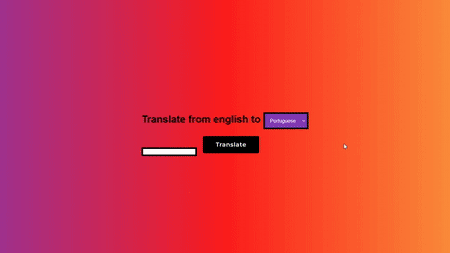
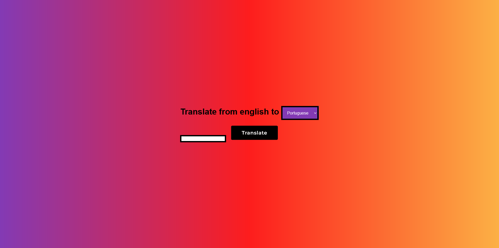

# Google Translator Api 🚀

 

## ⭐ Introduction

This is a simple project using the google translater api to translate english to ...

-  Users are able to translate to from english to either Portuguese, Russian or Ukranian, hindi, ....
    
    

## 🔥 Getting Started With The Project

-  Fork the Project in your Repository.
-  Clone the Forked Repository in your Local System.
-  Go to [RapidApi](https://rapidapi.com/googlecloud/api/google-translate1/) wait for it fully load and click subscribe
-  Then on the right bottom part you will see a text called <code>'X-RapidAPI-Key': 'KEY',</code> copy the 'KEY' and then paste it into the key.json
-  Run on Live Server.
-  Enjoy :)

For any issues related to the project, raise an ISSUE in the respective Repository.
 
 

## 🔨 Tools Used

-  Version Control System: Git
-  Programming / Scripting: JavaScript
-  Front-End: HTML, CSS
-  Integrated Development Environment: VSCode
    
    

## 💻 Screens

 

## 🐦 Contributed By:

* Bad

I hope you like the project. Thanks for reading :)
