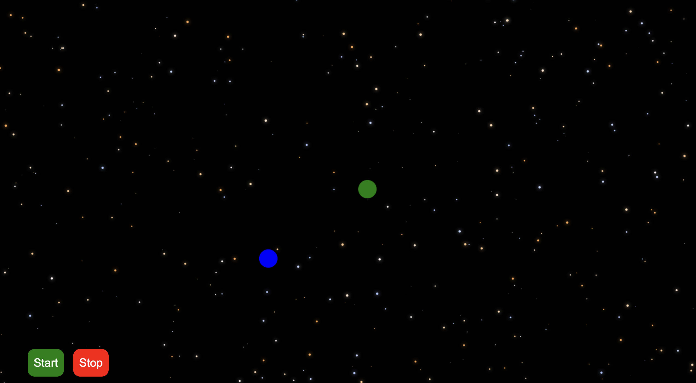

</img>

<!-- ABOUT THE PROJECT -->
## About The Project

This project is an excellent gravity simulator that allows users to adjust the position of bodies in space along with their velocities and their masses
and then once they start the simulation, the bodies are allowed to move freely under mutual gravitational force.

<!-- BUILT USING -->
## Built using

This project has been built using html, css and vanilla javascript. Canvas helped to create all the animations in the window.
