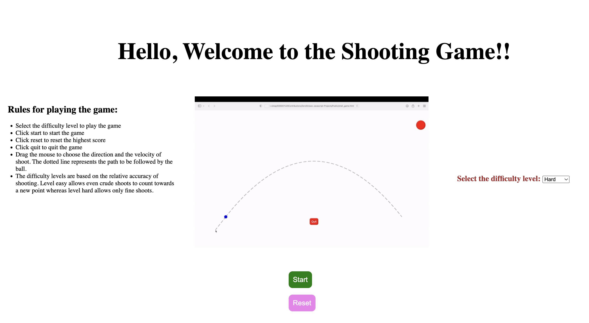

</img>

<!-- ABOUT THE PROJECT -->
## About The Project

This project is a cool Shooting Game where one can shoot a ball at the target with the desired speed and in the desired direction. A dotted line shows
the path followed by it once it is shot. The game has all basic and intermediate features like difficulty level, an easy to read rule book on the front
page as well as sound effects.

<!-- BUILT USING -->
## Built using

This project has been built using html, css and vanilla javascript. Html Canvas helped to provide the window where the objects can move and interact.
